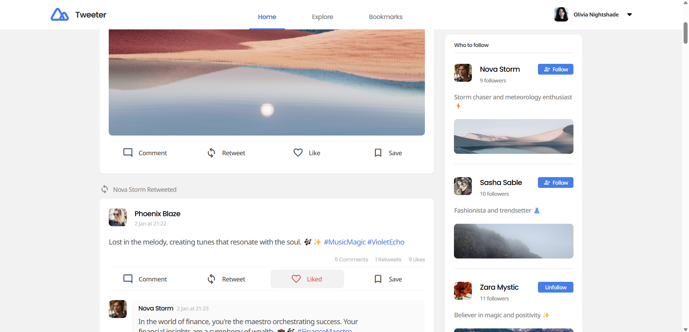

# Tweeter
Social media app resembling Twitter.

Backend is built with MongoDB for storing users, comments, tweets, likes, and Firebase Admin for cloud image hosting. Express was used to build the API in a REST format.

Front end built using React & JSX, and some utility libraries here and there.

Project is currently a work in progress. As of writing this it's about 70% complete. I've provided some screenshots of the interface below.

## Screenshots





## How to use
Obtain your `firebaseServiceAccountKey.json` for Firebase admin from Google console and save in backend/secrets

Replace empty fields in envsample with your own data and rename to `.env`

Use the sample user credentials supplied in backend/_data/user.json to login to the application, or create an account through the API via Postman while the project is still being built.

### Commands
Install dependencies

```
npm install
```

Run server

```
npm run dev
```

Flush existing data and seed database

```
npm run data:import
```

Flush all data from the database

```
npm run data:flush
```

## Roadmap...
- Add hashtag and user filtering on explore page
- Construct bookmarks page & relevant filters
- Develop profile page
- Create login & register screens